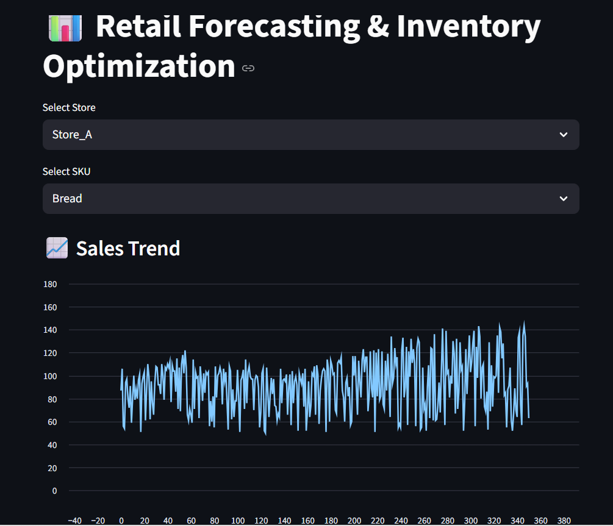
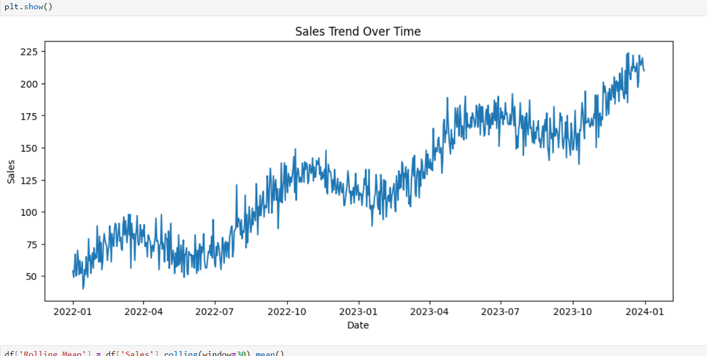
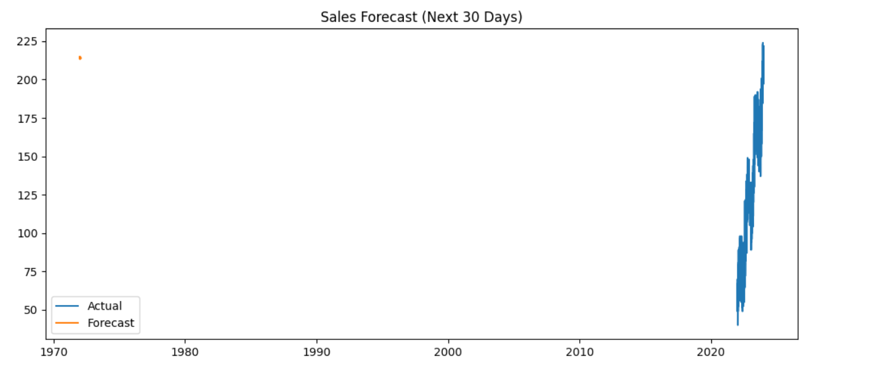
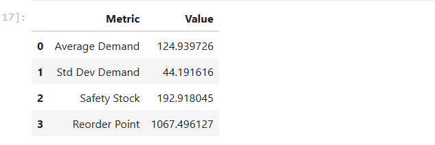
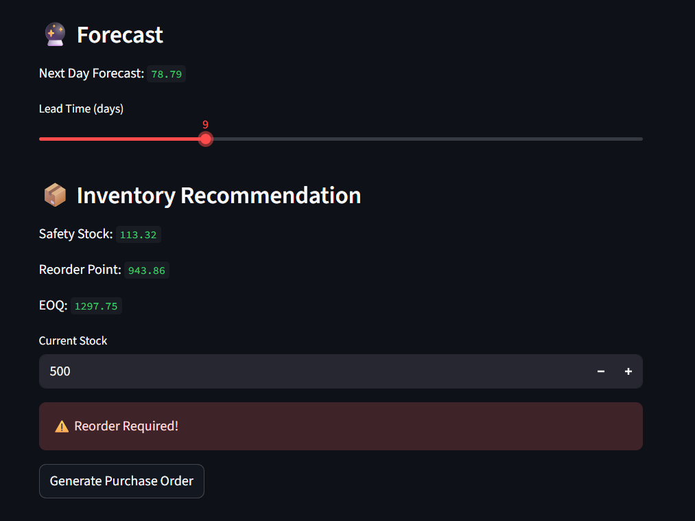
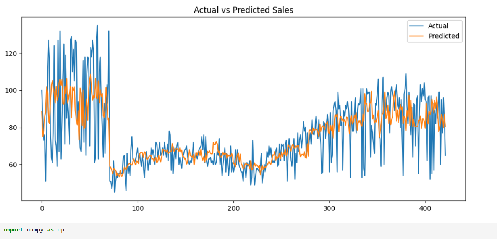
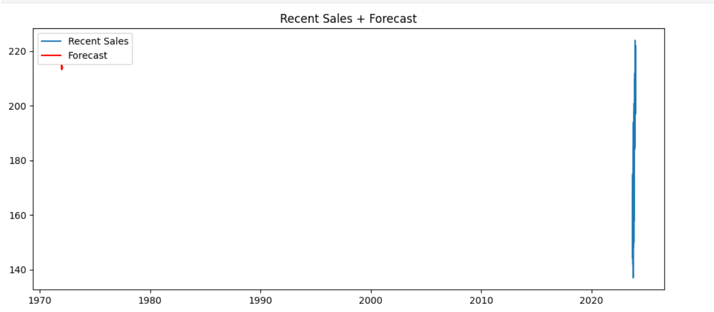
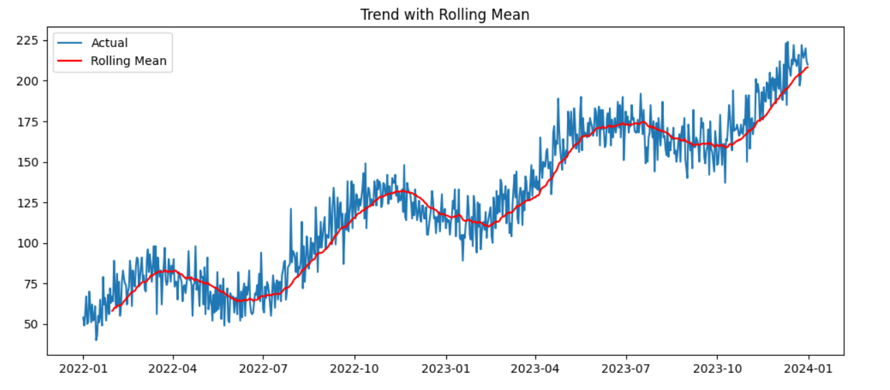
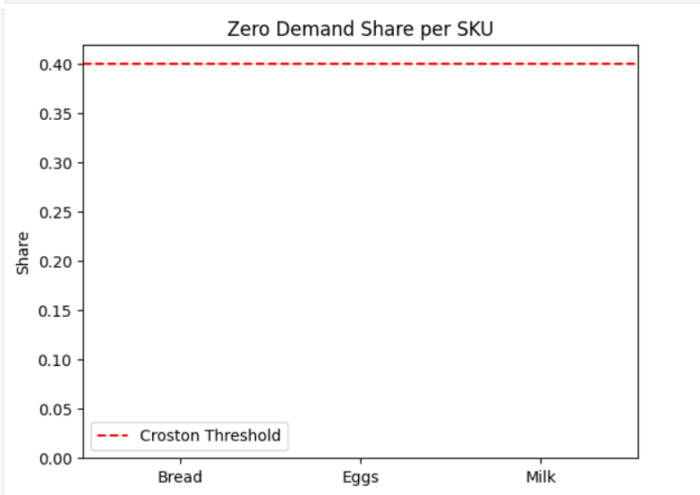

# 📊 Retail Sales Forecasting & Inventory Optimization System

## 🚀 Project Overview
This project is an end-to-end retail analytics system that forecasts product demand and optimizes inventory decisions using Machine Learning and business logic.

It simulates real-world retail scenarios like demand variability, stock management, and replenishment planning.

---

## 🎯 Problem Statement
Retail businesses often face:
- Overstocking → high holding cost
- Stockouts → lost sales
- Poor demand forecasting

This project solves these problems using data-driven forecasting and inventory optimization.

---

## 💡 Key Features
- 📈 Sales Forecasting using Random Forest
- 🔄 Hybrid modeling (Croston for intermittent demand)
- 📦 Inventory Optimization (Safety Stock, ROP, EOQ)
- ⚠️ Reorder Alert System
- 🖥️ Interactive Streamlit Dashboard
- 📄 Purchase Order Generation

---

## 🧠 Tech Stack
- Python
- Pandas, NumPy
- Scikit-learn
- Streamlit
- Matplotlib

---

## 🏗️ Project Architecture
1. Data preprocessing  
2. Feature engineering (lag, rolling, calendar)  
3. Model training (Random Forest)  
4. Forecast generation  
5. Inventory optimization  
6. Dashboard visualization  

---

## 📂 Folder Structure
## 📊 Results & Dashboard

### 🖥️ Dashboard Overview

### 📈 Sales Trend

### 🔮 Forecast Output

### 📦 Inventory Recommendation

### ⚠️ Reorder Alert

### Actual vs Predicted

### Recent sales+Forecast

### Trend with rolling mean

### Zero demand share

